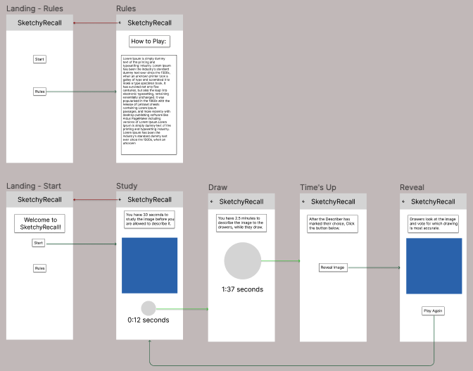

## SketchyRecall

SketchyRecall is an Android application developed loosely based on the board game [MonsDrawsity Party Board Game](https://www.geekyhobbies.com/monsdrawsity-party-board-game-rules-and-instructions-for-how-to-play/). The final product is meant to be used in place of a board game, at a party or other in person gathering. We used an AI image generating API called [Dezgo](https://dezgo.com/text2image/sdxl) to generate a new image based on a randomized prompt at the start of every round. SketchyRecall was originally developed as part of the WWC App Deploy Hackathon.

### Rules

In each round, players take turns being the Describer. Using the application, they start the game to generate an AI generated image based on randomly generated prompts. There are 4 phases of one game:

1. **Study (20 seconds):** The Describer studies the photo.
2. **Draw (2 minutes):** The image disappears and the describer describes the image to the other players. The other players draw out the image based on the description.
3. **Times up:** The players stop drawing.
4. **Reveal:** The reveal button is clicked, and the original image is revealed. The describer and all players vote on which drawing is the most accurate.

## API used

[Dezgo](https://dezgo.com/text2image/sdxl): An online image generator powered by AI, allowing for the generation of images from text descriptions.

## Features

- **Rules:** Users can navigate to the rules page to learn how to play the game.
- **Game Play:** New AI generated image called at the beginning of each game, based on a randomized prompt.

## Mockups

## Tech Stack

- Android Studio
- Kotlin
- Google Cloud Functions
- Jetpack Compose

## Feedback?

Reach out to olivia.golden.w@gmail.com!
